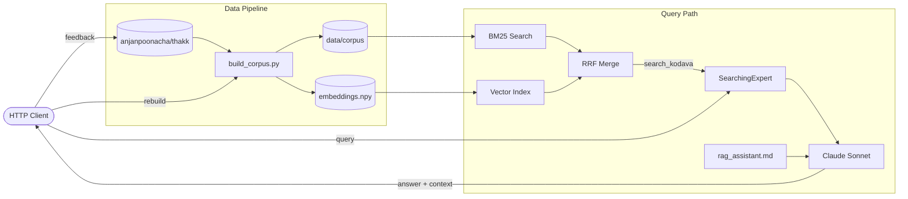

# kodava-rag

RAG system for Kodava takk — a Dravidian language spoken in Coorg (Kodagu), Karnataka.

Queries answered using BM25 retrieval over a verified corpus, with Claude as the language model.

---

## Quick start

```bash
make install
cp .env.example .env   # add ANTHROPIC_API_KEY
make corpus            # build the index
make query Q="how do I say I went to work"
```

---

## Make targets

```
make help              # list all targets
```

| Target | What it does |
|--------|-------------|
| `make install` | Install Python dependencies |
| **Corpus** | |
| `make corpus` | Rebuild `data/corpus/` from all thakk sources |
| `make fill-kannada` | Batch-fill empty Kannada script fields in the corpus |
| `make phonemes` | Regenerate phoneme rule tables in all prompts from the phoneme map |
| `make check-vocab` | Scan vocab tables for word-final `e` rendering errors |
| **Query** | |
| `make query Q="..."` | Run a single query against the RAG pipeline |
| `make api` | Start the API server at http://localhost:8000 |
| **Eval** | |
| `make baseline` | Structural health probe — retrieval + corpus + prompt (no LLM cost) |
| `make eval-retrieval` | BM25 retrieval correctness suite (no LLM cost, ~5s) |
| `make eval-llm` | Full LLM response quality eval (uses Claude, ~25s) |
| `make eval` | Run all three in order |
| **Transcription** | |
| `make transcribe FILE=audio.mp3` | Transcribe an audio file → timestamped transcript |
| `make transcribe-vocab FILE=transcript.md` | Extract vocabulary table from a transcript |
| **thakk submodule** | |
| `make thakk-update` | Pull latest changes from the thakk language data repo |
| `make thakk-push MSG="..."` | Commit and push edits in `data/thakk/` |

---

## Common workflows

### Add or fix a word

```bash
# 1. Edit the source file in the thakk submodule
open data/thakk/corpus/vocabulary.md

# 2. Commit and push to thakk
make thakk-push MSG="corpus: add chatthe (market)"

# 3. Rebuild the local index
make corpus
```

### Fix a Kannada script rendering

```bash
# 1. Find and fix the wrong row in the vocab table
python scripts/check_vocab_tables.py          # shows violations
open data/thakk/audio-vocab/sessions/session_01/vocab_table.md

# 2. Commit and rebuild
make thakk-push MSG="corpus: fix Kannada rendering for katthe"
make corpus
```

### Add or fix a phoneme rule

```bash
# 1. Edit the phoneme map (single source of truth)
open data/thakk/phoneme_table/kodava_devanagari_map.json

# 2. Commit to thakk
make thakk-push MSG="phonemes: add ny→ಞ palatal nasal"

# 3. Regenerate rule tables in all three prompts from the map
make phonemes

# 4. Review and commit the prompt changes
git diff prompts/ scripts/transcribe_audio.py
git add prompts/ scripts/transcribe_audio.py
git commit -m "prompts: regenerate phoneme rules"
```

### Transcribe a new audio session

```bash
make transcribe FILE=path/to/session_14.mp3
# → writes data/thakk/audio-vocab/sessions/session_14/transcription.md

make transcribe-vocab FILE=data/thakk/audio-vocab/sessions/session_14/transcription.md
# → writes vocab_table.md in same directory

make check-vocab                   # verify Kannada rendering
make thakk-push MSG="corpus: add session_14 vocab"
make corpus
```

### Run eval before merging

```bash
make baseline          # structural check (free)
make eval-retrieval    # BM25 layer (free, ~5s)
make eval-llm          # LLM quality (paid, ~25s)
```

---

## Architecture



### Data flow

```
anjanpoonacha/thakk  (git submodule → data/thakk/)
│
├── corpus/                      ← hand-curated seed entries — edit here
│   ├── vocabulary.md            words, greetings, core vocabulary
│   ├── grammar_rules.md         corrections and grammar rules
│   ├── phonemes.md              phoneme mappings
│   └── sentences.md             verified sentences and feedback
│
├── phoneme_table/
│   └── kodava_devanagari_map.json  ← phoneme source of truth
│                                      edit → run: make phonemes
│
├── audio-vocab/sessions/*/
│   └── vocab_table.md           ← session vocabulary tables (4-column MD)
│
├── kodava_corrections.md        ← native speaker corrections
├── elementary_kodava_FINAL.md   ← primary textbook (16 lessons)
└── training_data/               ← conjugations, grammar flags

         ↓  make corpus
         ↓  (build_corpus.py + ingesters)

data/corpus/                     ← generated build output (gitignored)
    vocabulary.jsonl                 merged from all vocabulary sources
    grammar_rules.jsonl              merged from grammar sources
    phonemes.jsonl                   merged from phoneme map + corpus
    sentences.jsonl                  hand-verified entries preserved across builds
    sentences_lesson.jsonl           lesson Q&A flashcards (split for BM25)
    sentences_narrative.jsonl        audio/narrative paragraphs
```

**Never edit `data/corpus/`** — it is generated by `make corpus` and gitignored.

---

## Prompts

| File | Purpose | How to edit |
|------|---------|-------------|
| `prompts/rag_assistant.md` | System prompt — hot-loaded from GitHub at container startup | Edit directly, push to main, restart pod |
| `prompts/fill_kannada.md` | Kannada script rendering rules for `make fill-kannada` | Edit directly |
| `scripts/transcribe_audio.py` | Transcription and vocab extraction prompts | Edit the prompt strings inside the file |

Phoneme rule tables inside all three prompts are **auto-generated**. Edit the phoneme map, then run `make phonemes` — never edit the `<!-- PHONEME-RULES:...:BEGIN/END -->` sections manually.

---

## Endpoints

| Method | Path | Description |
|--------|------|-------------|
| `POST` | `/query` | `{"q": "..."}` → answer + context |
| `POST` | `/feedback` | Save correction or rejection |
| `GET`  | `/review` | Pending rejected items |
| `GET`  | `/health` | Health check |

```bash
# Example query
curl -X POST http://localhost:8000/query \
  -H "Content-Type: application/json" \
  -d '{"q": "how do I say good morning"}'

# Submit a correction
curl -X POST http://localhost:8000/feedback \
  -H "Content-Type: application/json" \
  -d '{"query":"...","answer":"...","correction":"...","status":"corrected"}'
```

`status`: `approved` | `corrected` | `rejected`

---

## Environment

```bash
ANTHROPIC_API_KEY=your-key
ANTHROPIC_BASE_URL=http://localhost:6655/anthropic   # optional local proxy
SOURCE_PATH=/path/to/thakk/source                    # optional override
```
