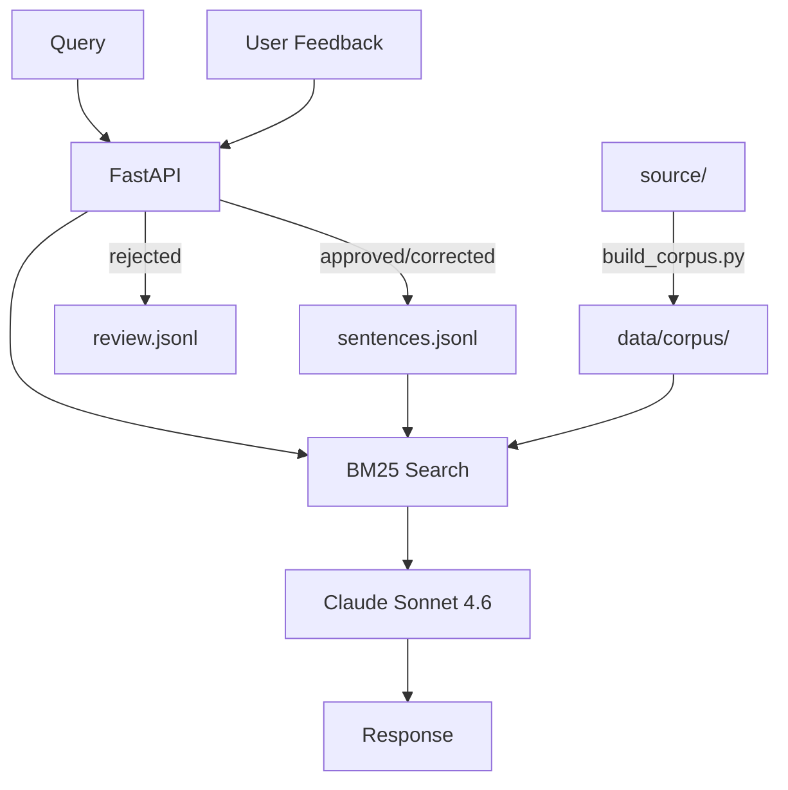

# kodava-rag

RAG system for Kodava takk language queries.

## Setup
```bash
pip install -r requirements.txt
cp .env.example .env  # add ANTHROPIC_API_KEY
python scripts/build_corpus.py
```

## Run
```bash
# CLI
python query.py how do I say good morning

# API
uvicorn api.app:app --reload
```

## Architecture


## Data
- `source/` — human truth, edit here
- `data/corpus/` — auto-built, do not edit
- `data/corpus/sentences.jsonl` — add verified pairs here

## Add a sentence
```bash
echo '{"id":"s001","kodava":"naan poanê.","devanagari":"नान पोअनॅ.","english":"I went."}' >> data/corpus/sentences.jsonl
```
