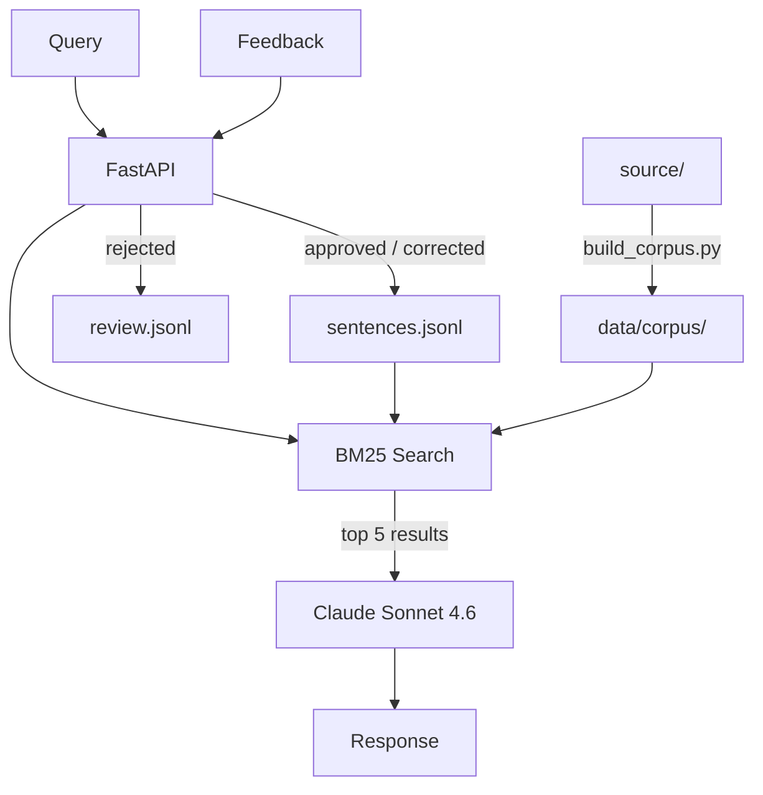

# kodava-rag

RAG system for Kodava takk — a Dravidian language spoken in Coorg, Karnataka.

Queries answered using BM25 retrieval over a verified corpus, with Claude as the language model.

## Setup

```bash
make install
cp .env.example .env   # add ANTHROPIC_API_KEY
```

For local proxy:
```
ANTHROPIC_API_KEY=your-key
ANTHROPIC_BASE_URL=http://localhost:6655/anthropic
SOURCE_PATH=/path/to/thakk/source
```

## Run

```bash
make query ARGS="how do I say I went to work"
make api    # → http://localhost:8000
```

## Architecture



## Endpoints

| Method | Path | Description |
|---|---|---|
| `POST` | `/query` | `{"q": "..."}` → answer + context |
| `POST` | `/feedback` | Save correction or rejection |
| `GET` | `/review` | Pending rejected items |
| `GET` | `/health` | Health check |

### Feedback

```bash
curl -X POST http://localhost:8000/feedback \
  -H "Content-Type: application/json" \
  -d '{"query":"...","answer":"...","correction":"...","status":"corrected"}'
```

`status` is one of `approved` | `corrected` | `rejected`.

- `approved` / `corrected` → `data/corpus/sentences.jsonl` (live in RAG immediately)
- `rejected` → `data/corpus/review.jsonl` (review queue)

## Corpus

| File | Source | Editable |
|---|---|---|
| `data/corpus/vocabulary.jsonl` | `$SOURCE_PATH/audio/vocab_tables/` | via `build_corpus.py` |
| `data/corpus/grammar_rules.jsonl` | `$SOURCE_PATH/corrections/` | via `build_corpus.py` |
| `data/corpus/sentences.jsonl` | Native speaker / feedback | direct |
| `data/corpus/review.jsonl` | Rejected feedback | promote manually |

`SOURCE_PATH` defaults to `../thakk/source` — set it in `.env` if your `thakk` repo is elsewhere.

Rebuild derived corpus after editing source:
```bash
make corpus
```
