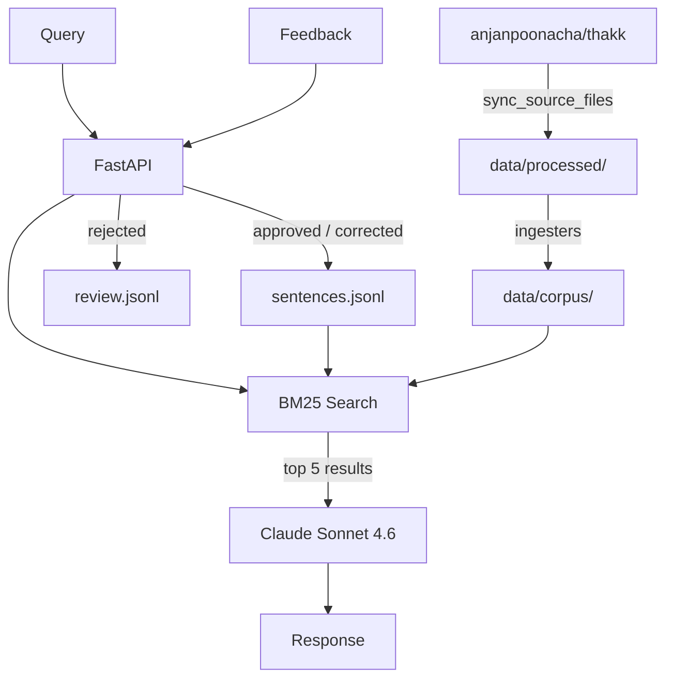

# kodava-rag

RAG system for Kodava takk — a Dravidian language spoken in Coorg, Karnataka.

Queries answered using BM25 retrieval over a verified corpus, with Claude as the language model.

## Setup

```bash
make install
cp .env.example .env   # add ANTHROPIC_API_KEY
```

For local proxy:
```
ANTHROPIC_API_KEY=your-key
ANTHROPIC_BASE_URL=http://localhost:6655/anthropic
SOURCE_PATH=/path/to/thakk/source
```

## Run

```bash
make query ARGS="how do I say I went to work"
make api    # → http://localhost:8000
```

## Architecture



### Data flow

```
anjanpoonacha/thakk
├── corpus/                   ← hand-curated seed entries (source of truth)
│   ├── grammar_rules.jsonl   edit here to add/remove grammar corrections
│   ├── vocabulary.jsonl
│   ├── phonemes.jsonl
│   └── sentences.jsonl
└── training_data/            ← structured source files
    ├── conjugations.jsonl
    ├── grammar_flags.json
    └── transliteration.json
        ↓  github_sync.sync_source_files()
data/processed/               ← local cache of thakk source (gitignored)
        ↓  build_corpus.py + ingesters
data/corpus/                  ← generated build output (gitignored)
    grammar_rules.jsonl           merged from corpus/ + grammar_flags.json + textbook
    vocabulary.jsonl              merged from corpus/ + vocab tables
    phonemes.jsonl                merged from corpus/ + phoneme map
    sentences.jsonl               hand-verified entries preserved across builds
    review.jsonl                  rejected feedback queue (never overwritten)
```

**Do not push `data/corpus/` files back to thakk** — they are generated artefacts.
To make a permanent correction, edit the relevant file in `anjanpoonacha/thakk/corpus/` directly, then run `make corpus` to rebuild locally.

## Endpoints

| Method | Path | Description |
|---|---|---|
| `POST` | `/query` | `{"q": "..."}` → answer + context |
| `POST` | `/feedback` | Save correction or rejection |
| `GET` | `/review` | Pending rejected items |
| `GET` | `/health` | Health check |

### Feedback

```bash
curl -X POST http://localhost:8000/feedback \
  -H "Content-Type: application/json" \
  -d '{"query":"...","answer":"...","correction":"...","status":"corrected"}'
```

`status` is one of `approved` | `corrected` | `rejected`.

- `approved` / `corrected` → `data/corpus/sentences.jsonl` (live in RAG immediately)
- `rejected` → `data/corpus/review.jsonl` (review queue)

## Corpus

All corpus files under `data/corpus/` are **generated** and gitignored. The source of truth is `anjanpoonacha/thakk`.

| Generated file | Built from | How to edit |
|---|---|---|
| `data/corpus/grammar_rules.jsonl` | `thakk/corpus/grammar_rules.jsonl` + `training_data/grammar_flags.json` + textbook | Edit in thakk, then `make corpus` |
| `data/corpus/vocabulary.jsonl` | `thakk/corpus/vocabulary.jsonl` + vocab table source files | Edit in thakk, then `make corpus` |
| `data/corpus/phonemes.jsonl` | `thakk/corpus/phonemes.jsonl` + phoneme map | Edit in thakk, then `make corpus` |
| `data/corpus/sentences.jsonl` | `thakk/corpus/sentences.jsonl` + feedback approvals | Edit in thakk or via `/feedback` endpoint |
| `data/corpus/review.jsonl` | Rejected feedback | Promote entries manually to sentences.jsonl |

Rebuild after editing source files in thakk:
```bash
make corpus
```
