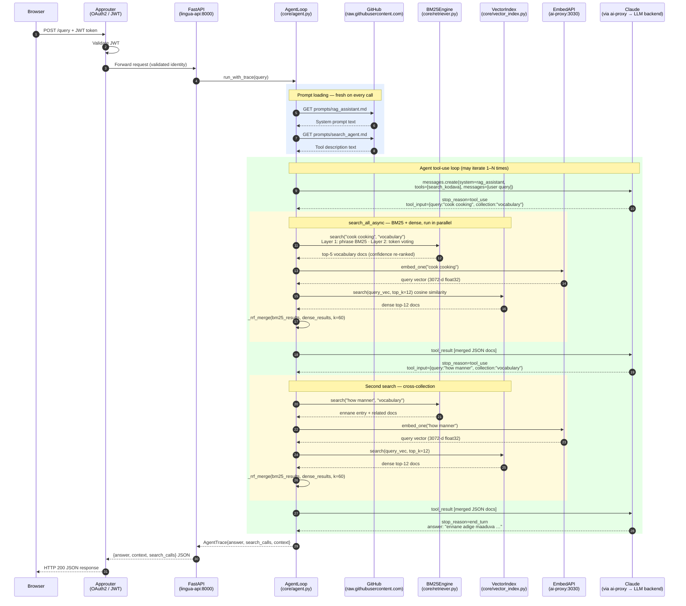
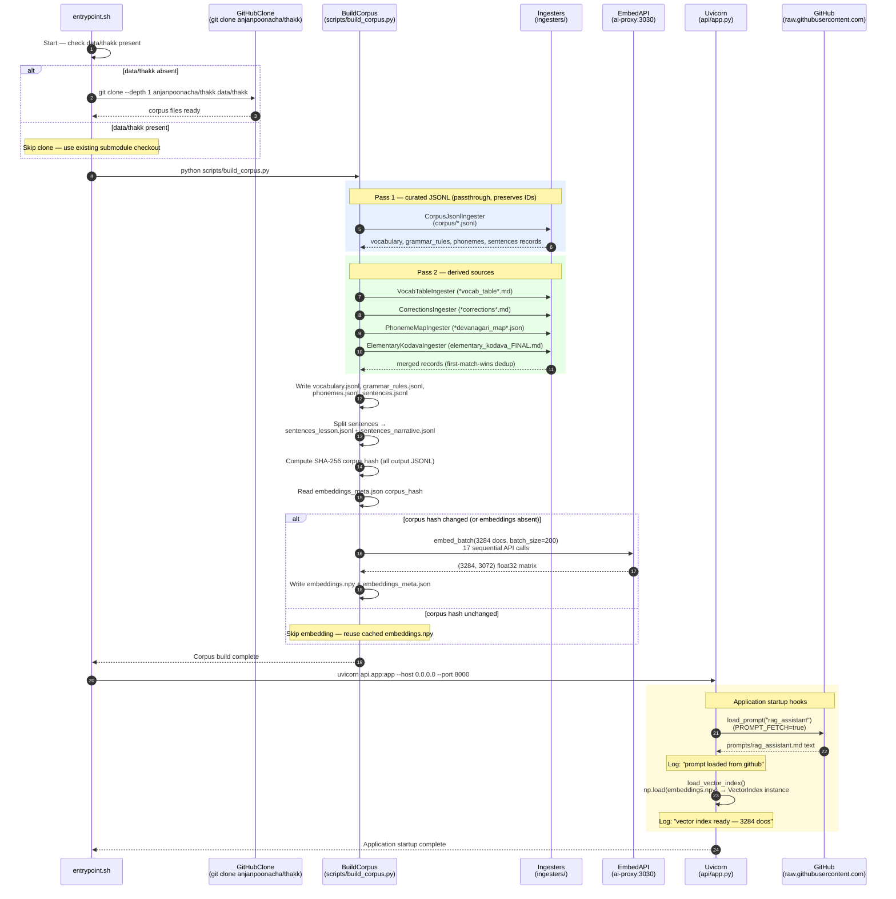

# Kodava RAG — Sequence Diagrams

## Diagram 1: User Query Flow

Shows the full lifecycle of a `POST /query` or `/agent/stream` request: OAuth2 JWT authentication,
multi-turn Claude tool-use loop, hybrid BM25 + dense retrieval, and response delivery.

---

## Diagram 2: Startup / Corpus Build Flow

Shows container startup: optional `thakk` clone, full corpus ingestion pipeline, conditional
embedding generation (skipped when corpus hash is unchanged), and FastAPI initialisation.

